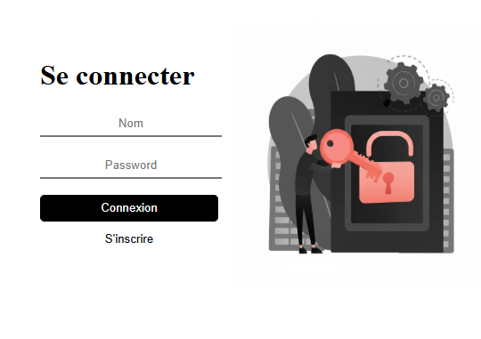
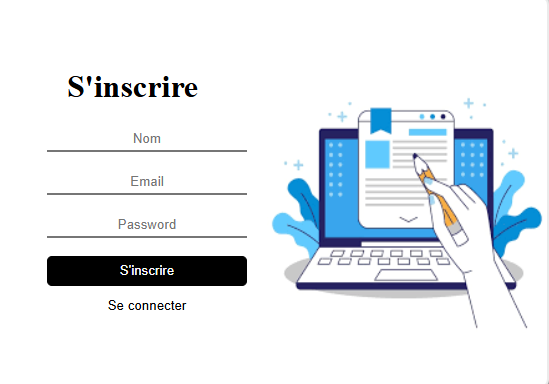
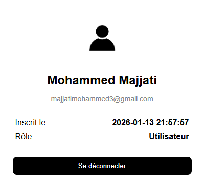

#  Projet d’Authentification avec Flask

Ce projet est une application web simple permettant :
- l’inscription des utilisateurs,
- la connexion (login),
- la gestion de session,
- l’affichage d’un profil utilisateur avec la date d’inscription.



---



---




Il est développé avec **Flask**, **SQLite** et **JavaScript (Fetch API)**, en utilisant une architecture propre basée sur les **Blueprints**.

---

##  Fonctionnalités

-  Inscription des utilisateurs
-  Connexion / Déconnexion
-  Gestion des sessions avec Flask
-  Profil utilisateur
-  Date d’inscription automatique
-  API REST (JSON)
-  Pages HTML dynamiques
-  Base de données SQLite
-  Structure modulaire (Blueprints)

---

##  Technologies utilisées

- Python 3
- Flask
- SQLite
- HTML5 / CSS3
- JavaScript (Fetch API)

---

##  Structure du projet

```text
project/
│
├── app.py
├── database.py
├── run.py
│
├── routes/
│   ├── Inscription.py
│   └── Connecter.py
│
├── templates/
│   ├── index.html
│   ├── Inscription.html
│   └── profile.html
│
├── static/
│   ├── images
│   └── script.js
│   ├── index.css
│   ├── Inscription.csi
│   └── profile.css
│
└── database.db

---

##  Structure du projet

```bash

python run.py